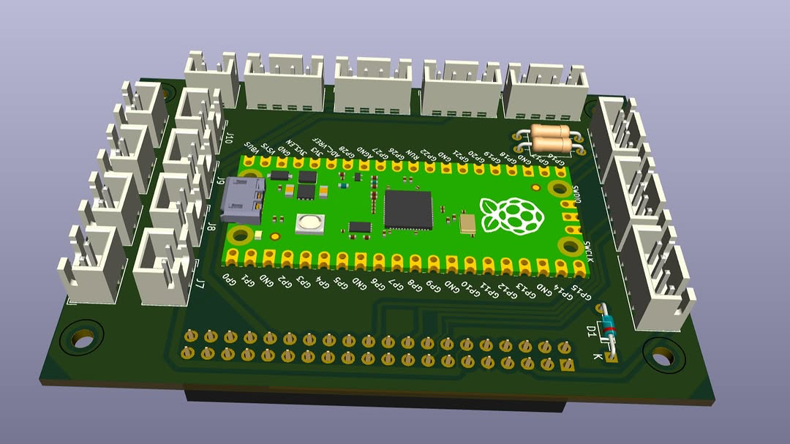

# Hardware

---

## **Power Distribution Board (PDB)**

*Note: a few XT60 connectors were not attached in this image.*

**Download:**

* [PDB schematic (`.kicad_sch`)](Power_Distribution_Board/PDB.kicad_sch)
* [PDB PCB layout (`.kicad_pcb`)](Power_Distribution_Board/PDB.kicad_pcb)
* [PDB 3D model (`.step`)](Power_Distribution_Board/PDB.step)
* [PDB bill of materials (`.csv`)](Power_Distribution_Board/PDB.csv)
* [PDB XML export (`.xml`)](Power_Distribution_Board/PDB.xml)
* [PDB project file (`.kicad_pro`)](Power_Distribution_Board/PDB.kicad_pro)
* [PDB KiCad backup schematic (`.kicad_sch-bak`)](Power_Distribution_Board/PDB.kicad_sch-bak)
* [PDB KiCad project local file (`.kicad_prl`)](Power_Distribution_Board/PDB.kicad_prl)

---

## **Control Board**

**Download:**

* [Control Board schematic (`.kicad_sch`)](Control_Board/Control_Board.kicad_sch)
* [Control Board PCB layout (`.kicad_pcb`)](Control_Board/Control_Board.kicad_pcb)
* [Control Board 3D model (`.step`)](Control_Board/Control_Board.step)
* [Control Board project file (`.kicad_pro`)](Control_Board/Control_Board.kicad_pro)
* [Control Board KiCad backup schematic (`.kicad_sch-bak`)](Control_Board/Control_Board.kicad_sch-bak)
* [Control Board KiCad project local file (`.kicad_prl`)](Control_Board/Control_Board.kicad_prl)
* [Control Board legacy project file (`.pro`)](Control_Board/Control_Board.pro)
