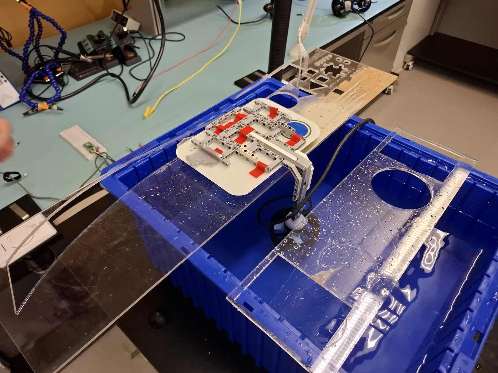
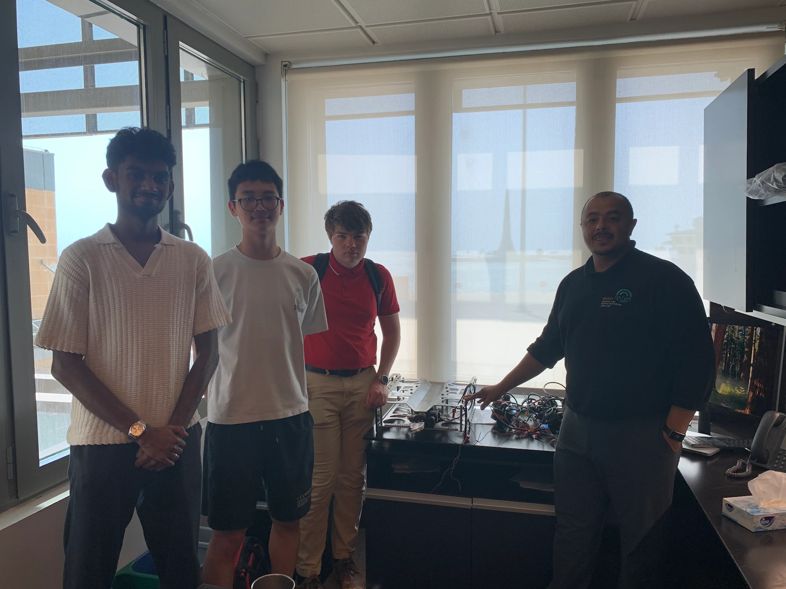

# Models

---

## **ROV Model**

[Pool Test Video](https://youtu.be/HalhtXvYYro)

**Download:**  
- [ROV STEP file](files/ROV.step) ([f3z Google Drive file](https://drive.google.com/file/d/1CSuDAXggwamgUQ0F3YDBGZ4MGBTvEjoI/view?usp=sharing))
- [Gripper STEP file](files/Gripper.step) ([f3z Google Drive file](https://drive.google.com/file/d/1I8YvQWp7bbg3L94b0wb-usT_5LE429A_/view?usp=sharing))
- [Photosphere Github download](files/Photosphere.step) ([f3z file](files/Photosphere.f3z))

A custom T200-to-Lego adapter was designed for thrust testing. The STL file can be accessed [here](files/T200_Lego.stl). 

After the competition, a representative from the Coastal and Marine Resources Core Lab (CMR), one of our sponsors, was impressed by our design of the ROV. As a gesture of appreciation for CMR’s support, we decided to donate the ROV to CMR for their professional applications.

---

## **Float Model**

**Download:**  

- [Float STEP file](files/Float.step) ([f3z file](files/Float.f3z))
