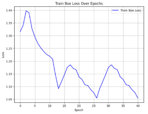
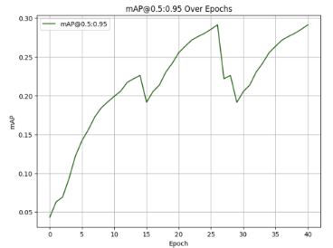
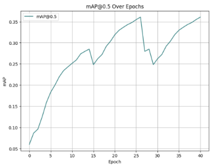

# Program Explanation

**NOAA Ocean Exploration**  
**Ocean Exploration Video Challenge**

---

## **Compute Resources**

Training a visual detection model is computationally intensive, especially when using a dataset of 99k images, as we did. Most laptop and desktop computers will struggle with upwards of 100 images when training on CPUs, and training with one GPU introduces unreasonable training times for large datasets. Therefore, we decided to use a GPU cluster provided by AWS. There, we stored all of our images and trained using job scripts in the SLURM format.  

For prototyping and proof-of-concept purposes, we began by training in Google Colab, but were limited by free GPU credits. Then, we used an AWS cluster with one GPU. Finally, we trained our model using 8 GPUs in the AWS cluster.  

---

## **Code Overview**

We decided to use the model architecture **YOLOv9** with pretrained weights to train our model. Let’s go step by step and learn how to code the model (*please note that most code blocks are snippets and not fully executable scripts*).  

### **Fetching the Data**

This step involves downloading the provided JSON file from **FathomNet**, which contains references to various locations for bounding box annotations, file names, and classes. To maintain consistency, we named each image with its UUID. Below is a snippet of the function we used for this purpose:

```python
def download_image(file):
    filename = file["uuid"]
    url = file["url"]
    image_path = os.path.join(images_directory, filename + ".png")

    if not os.path.exists(image_path):
        try:
            response = requests.get(url, timeout=10)
            if response.status_code == 200:
                with open(image_path, "wb") as img_file:
                    img_file.write(response.content)
                print(f"Image {filename} downloaded successfully.")
                return True
            else:
                print(f"Failed to retrieve the image {filename}. Status code: {response.status_code}")
                return False
        except requests.RequestException as e:
            print(f"Error downloading {filename}: {e}")
            return False
    else:
        print(f"Image {filename} already exists. Skipping download.")
        return False
````

To increase the efficiency of downloading the images, we applied concurrent downloads as shown below:

```python
with ThreadPoolExecutor(max_workers=50) as executor:
    futures = [executor.submit(download_image, file) for file in data]
    for future in as_completed(futures):
        future.result()
```

---

### **Refining the Data**

During the organisation of the files, we refined the dataset to remove any files without crucial information for training purposes and any images or JSON entries that didn’t match or were extra. For example, here is a code snippet to find any extra JSON entries or extra image files:

```python
json_file_path = "data.json"
images_directory = "images/"

with open(json_file_path, "r") as file:
    data = json.load(file)

json_filenames = {entry["uuid"] + ".png" for entry in data}
image_filenames = {filename for filename in os.listdir(images_directory) if filename.endswith(".png")}

extra_json_entries = json_filenames - image_filenames
extra_image_files = image_filenames - json_filenames
```


---

### **Organising in YOLO Format**

YOLOv9 requires a very specific data setup for it to function. The basic structure is:
`labels/` and `images/` directories, containing `train/` and `val/` subdirectories (often with an 80/20 split respectively), plus a `data.yaml` file outlining directory paths, number of classes, and class names.

To start, we will use the JSON file of the dataset (in our case FathomNet) to extract the annotations and classes with which we will create our YOLO dataset. Here is a snippet of the function we used to do this:

```python
def extract_json(filename):
    json_file_path = filename
    parser = []

    with open(json_file_path, "r") as file:
        data = json.load(file)  # A

    for file in data:
        filename = os.path.join(file["uuid"] + ".png")
        imgwidth = file["width"]
        imgheight = file["height"]
        for box in file["boundingBoxes"]:
            name = box["concept"]
            boxx = box["x"]
            boxy = box["y"]
            boxwidth = box["width"]
            boxheight = box["height"]  # B
```

Section **A** loads the JSON file given the file path, and section **B** extracts all the necessary data from each JSON entry corresponding to an image.

We used these extracted values to create the `.txt` annotation files in the labels directory, as well as extracting class names later.

To construct the directories, we used the `os` module in Python, specifically `os.makedirs`:

```python
os.makedirs("/ALLFathomNET_images/images/train", exist_ok=True)  # A
os.makedirs("/ALLFathomNET_images/images/val", exist_ok=True)    # A
os.makedirs("/ALLFathomNET_images/labels/train", exist_ok=True)  # A
os.makedirs("/ALLFathomNET_images/labels/val", exist_ok=True)    # A

def save_data(filename, images_folder_path, labels_folder_path, group_obj):
    source = os.path.join("/ALLFathomNET_images/images", filename)
    destination = os.path.join(images_folder_path, filename)
    move(source, destination)
    text_filename = os.path.join(labels_folder_path, os.path.splitext(filename)[0] + ".txt")
    group_obj.get_group(filename).set_index("filename").to_csv(text_filename, sep=' ', index=False, header=False)  # B
```

In the code block above, we created the necessary directories with section **A** and loaded all the annotations and images into their respective directories with section **B**.

Finally, we made our `data.yaml` file containing the key pointers the model needs to access the data:

```python
data = {
    'train': '/ALLFathomNET_images/images/train',
    'val': '/ALLFathomNET_images/images/test',
    'nc': len(labels),
    'names': list(labels.keys())
}

with open('/ALLFathomNET_images/data.yaml', 'w') as file:
    yaml.dump(data, file, default_flow_style=False, sort_keys=False)
```

---

### **Training the Model**

Training with YOLOv9 consists of using the `train.py` function obtained from cloning the repository. In a kernel or terminal, run:

```bash
%cd {HOME}/yolov9  # A
!python train.py \
  --batch 16 --epochs 50 --img 640 --device 0 --min-items 0 --close-mosaic 15 \  # B
  --data /ALLFathomNET_images/data.yaml \  # C
  --weights {HOME}/weights/gelan-c.pt \    # D
  --cfg models/detect/gelan-c.yaml \       # E
  --hyp hyp.scratch-high.yaml
```

Section **A** navigates to the `yolov9` directory cloned from GitHub. Section **B** sets basic parameters for model training. Setting `device=0` means training on one GPU. Sections **C**, **D**, and **E** provide paths to the `data.yaml` file, weights file, and configuration file respectively.

We used the **gelan-c** variant due to its lower computational demands while maintaining strong performance.

---

### **Viewing the Results**

Once training is complete, a `results.png` file will appear showing key model performance metrics (loss and precision).

* **Loss** quantifies the disparity between predictions and true labels.
* **Precision** = True Positives / (True Positives + False Positives).

To view results:

```python
from IPython.display import Image
Image(filename=f"{HOME}/yolov9/runs/train/exp/results.png", width=1000)
```

You can also plot training progress directly using the `results.csv` file:

```python
import pandas as pd
import matplotlib.pyplot as plt

csv_files = [
    'path/to/results1.csv',
    'path/to/results2.csv',
    'path/to/results3.csv'  # A
]

combined_df = pd.DataFrame()
epoch_counter = 0

for csv_file in csv_files:
    df = pd.read_csv(csv_file)  # B
    df.index += epoch_counter
    combined_df = pd.concat([combined_df, df], ignore_index=True)
    epoch_counter += len(df)

plt.figure(figsize=(8, 6))  # C
plt.plot(combined_df.index, combined_df['train/box_loss'], label='Train Box Loss', color='blue')
plt.title('Train Box Loss Over Epochs')
plt.xlabel('Epoch')
plt.ylabel('Loss')
plt.legend()
plt.grid(True)
plt.show()
```

Section **A** defines paths to CSV files, **B** concatenates them, and **C** plots one of the metrics. There are 13 in total.

---

## **User Guide**

The YOLOv9 GitHub repository includes a Python file for running model inference.

To use the model for object detection in a video:

1. Download our trained model weights.
2. Clone the [YOLOv9 GitHub repository](https://github.com/WongKinYiu/yolov9).
3. Use a terminal window and navigate to that directory.
4. Run the following commands:

```bash
pip install -r requirements.txt
python detect.py --source /path/to/video.mp4 --weights '/path/to/weights.pt'
```

The output will indicate the directory where the processed video is saved.

---

## **Model Metrics**

Training metrics can be broadly split into **precision** and **loss**. Over time, performance plateaus even though training continues. By observing these graphs, we can identify when to stop training.

If training metrics improve while validation metrics plateau, the model is **overfitting**.




![ref1]
![ref2]






We can see that both the precision and loss metrics have plateaued, indicating that further training would show little improvement. However, large spikes in the middle of training suggest that an incorrect weights file may have been transferred between sessions, reducing model accuracy.

[ref1]: images/ref1.png
[ref2]: images/ref2.png

---

## Model Availability and Credits

Our final trained **YOLOv9 model** is publicly available under an open-source license for research and educational use.

**Download:**  
[Trained model weights (.pt)](https://huggingface.co/petabytecat/rovolutionaries-object-detection/tree/main)  

This project was developed as part of the **NOAA Ocean Exploration Video Challenge** by the **ROVolutionaries**.  
We gratefully acknowledge:

- **NOAA Ocean Exploration** for providing the FathomNet dataset.  
- **Wong Kin Yiu** for open-sourcing the YOLOv9 model.  
- **AWS Cloud Credits for Research** for computational resources.  
- **Aspose** for Converting Word file to Markdown.  
