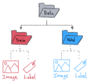
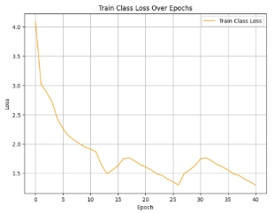
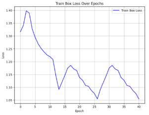
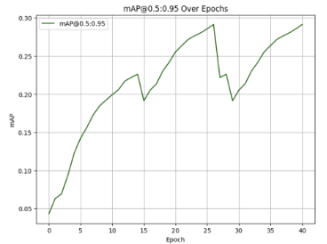
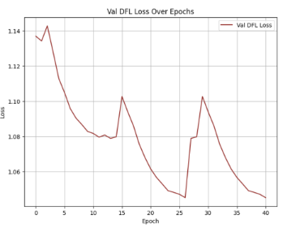
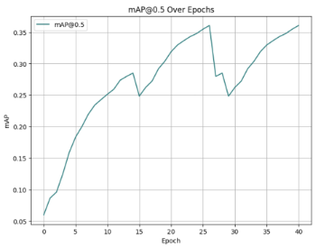
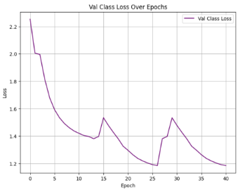

Program Explanation 		  NOAA Ocean Exploration 

ROVolutionaries

Ocean Exploration Video Challenge

The KAUST School, Thuwal (Kingdom of Saudi Arabia)

-----
## **Compute Resources**
Training a visual detection model is computationally intensive, especially when using a dataset of 99k images, as we did. Most laptop and desktop computers will struggle with upwards of 100 images when training on CPUs, and training with one GPU introduces unreasonable training times for large datasets. Therefore, we decided to use a GPU cluster provided by AWS. There, we stored all of our images and trained using job scripts in the SLURM format. 

For prototyping and proof of concept purposes, we began by training in Google Colab, but were limited by free GPU credits. Then, we used an AWS cluster with one GPU. Finally, we trained our model using 8 GPUs in the AWS cluster. 

## **Code Overview**
We decided to use the model architecture YOLOv9 with pretrained weights to train our model. Let’s go step by step and learn how to code the model (*please note that most code blocks are snippets and not fully executable scripts)*. 

**Fetching the Data:** This step involves downloading the provided JSON file from Fathomnet, which contains references to various locations for bounding box annotations, file names, and classes. To maintain consistency, we named each image with its UUID. Below is a snippet of the function we used for this purpose:

def download\_image(file):

`    `filename = file["uuid"]

`    `url = file["url"]

`    `image\_path = os.path.join(images\_directory, filename + ".png")

`    `if not os.path.exists(image\_path):

`        `try:

`            `response = requests.get(url, timeout=10)

`            `if response.status\_code == 200:

`                `with open(image\_path, "wb") as img\_file:

`                    `img\_file.write(response.content)

`                `print(f"Image {filename} downloaded successfully.")

`                `return True

`            `else:

`                `print(f"Failed to retrieve the image {filename}. Status code: {response.status\_code}")

`                `return False

`        `except requests.RequestException as e:

`            `print(f"Error downloading {filename}: {e}")

`            `return False

`    `else:

`        `print(f"Image {filename} already exists. Skipping download.")

`        `return False



To increase the efficiency of downloading the images, we applied concurrent downloads as shown below: 

with ThreadPoolExecutor(max\_workers=50) as executor:

`    `futures = [executor.submit(download\_image, file) for file in data]

`    `for future in as\_completed(futures):

`        `future.result()



**Refining the data:** During the organisation of the files, we refined the dataset to remove any files without crucial information for training purposes and any images or JSON entries that didn’t match or were extra. For example, here is a code snippet to find any extra JSON entries or extra image files: 

json\_file\_path = "data.json"

images\_directory = "images/"

with open(json\_file\_path, "r") as file:

`    `data = json.load(file)

json\_filenames = {entry["uuid"] + ".png" for entry in data}

image\_filenames = {filename for filename in os.listdir(images\_directory) if filename.endswith(".png")}

extra\_json\_entries = json\_filenames - image\_filenames

extra\_image\_files = image\_filenames - json\_filenames



**Organising in YOLO format:** YOLOv9 requires a very specific data setup for it to function. The basic structure is: labels and images directories, containing a train and val directory each (often with an 80/20 split respectively), plus a data.yaml file outlining directory paths, number of classes and class names. To start, we will have to use the json file of the dataset (in our case FathomNet) to extract the annotations and classes with which we will create our YOLO dataset. Here is a snippet of the function we used to do this:

def extract\_json(filename):

`    `json\_file\_path = filename 

`    `parser = []

`    `with open(json\_file\_path, "r") as file: 

`        `data = json.load(file) #A

`    `for file in data:

`        `filename = os.path.join(file["uuid"] + ".png") 

`        `imgwidth = file["width"]

`        `imgheight = file["height"]

`        `for box in file["boundingBoxes"]:

`            `name = box["concept"]

`            `boxx = box["x"]

`            `boxy = box["y"]

`            `boxwidth = box["width"]

`            `boxheight = box["height"] #B



Section #A loads the json file given the file path, and section #B extracts all the necessary data from each json entry corresponding to an image. We will use these extracted values to create the .txt files that comprise our annotations in the labels directory, as well as extracting class names later. To construct the directories, we used the os module in python, specifically the os.makedirs method:

os.makedirs("/ALLFathomNET\_images/images/train", exist\_ok=True) #A

os.makedirs("/ALLFathomNET\_images/images/val", exist\_ok=True) #A

os.makedirs("/ALLFathomNET\_images/labels/train", exist\_ok=True) #A

os.makedirs("/ALLFathomNET\_images/labels/val", exist\_ok=True) #A

def save\_data(filename, images\_folder\_path, labels\_folder\_path, group\_obj):

`    `source = os.path.join("/ALLFathomNET\_images/images", filename)

`    `destination = os.path.join(images\_folder\_path, filename)

`    `move(source, destination)

`    `text\_filename = os.path.join(labels\_folder\_path,os.path.splitext(filename)[0] + ".txt")

`  `group\_obj.get\_group(filename).set\_index("filename").to\_csv(text\_filename,sep=' ',index=False,header=False) #B



In the code block above, we created the necessary directories with section #A and loaded all the annotations and images into their respective directories with section #B. Finally, we made our data.yaml file containing the key pointers the model needs to access the data. 

data = {

`    `'train': '/ALLFathomNET\_images/images/train',

`    `'val': '/ALLFathomNET\_images/images/test',

`    `'nc': len(labels),

`    `'names': list(labels.keys())

}

with open('/ALLFathomNET\_images/data.yaml', 'w') as file:

`    `yaml.dump(data, file, default\_flow\_style=False, sort\_keys=False)



**Training the model:** Training with YOLOv9 consists of using the train.py function obtained from cloning the directory. In a kernel or in the terminal, run your train.py file:

%cd {HOME}/yolov9 #A

!python train.py \

--batch 16 --epochs 50 --img 640 --device 0 --min-items 0 --close-mosaic 15 \ #B

--data /ALLFathomNET\_images/data.yaml \ #C

--weights {HOME}/weights/gelan-c.pt \ #D

--cfg models/detect/gelan-c.yaml \ #E

--hyp hyp.scratch-high.yaml



Section #A navigates to the yolov9 directory cloned from github (HOME is a placeholder for wherever this may be located). Section #B sets the basic parameters for the model training. Setting device to 0 means we are training on one GPU.  Sections #C, #D, and #E provide paths to the data.yaml file, weights file, and yaml configuration file of the chosen model respectively. 

Note that in sections #C and #E, an extension of YOLOv9 called gelan-c is used. There are multiple such variants under the YOLOv9 umbrella, and different models can be substituted here (eg. YOLOv9-e, the most robust variant). We decided to use gelan-c due to its lower computational demands than YOLOv9-e while maintaining similar performance. 

**Viewing the Results:** Once the training is complete, a results.png file will appear that shows key model performance metrics which can be broadly placed under the umbrellas of loss and precision. Loss quantifies the disparity between the model’s predictions and the true labels of the data. It should decrease over time. Precision quantifiies the accuracy of predictions made by the model. Precision  = True Positives / True Positives + False Positives. Therefore, precision should go up as training progresses. To view results at the end of training, run the following: 

from IPython.display import Image

Image(filename=f"{HOME}/yolov9/runs/train/exp/results.png", width=1000)



Alternatively, you can graph performance during training, even when the results.png file has not been generated. A results.csv file is updated after each epoch, so plotting your performance graphs is a matter of reading the data from the CSV file using pandas and plotting it using matplotlib. 

In many cases, we utilised multiple training sessions for the same model, transferring the weights between these sessions. This makes it difficult to view a bigger picture of training metrics over all the epochs. To solve this problem, we concatenated all the results.csv files before training. 

import pandas as pd

import matplotlib.pyplot as plt

csv\_files = [

`    `'path/to/results1.csv',

`    `'path/to/results2.csv',

`    `'path/to/results3.csv', #A

combined\_df = pd.DataFrame()

epoch\_counter = 0

for csv\_file in csv\_files:

`    `df = pd.read\_csv(csv\_file) #B

`    `df.index += epoch\_counter #B

`    `combined\_df = pd.concat([combined\_df, df], ignore\_index=True) #B

`    `epoch\_counter += len(df) #B

plt.figure(figsize=(8, 6)) #C

plt.plot(combined\_df.index, combined\_df['train/box\_loss'], label='Train Box Loss', color='blue')

plt.title('Train Box Loss Over Epochs')

plt.xlabel('Epoch')

plt.ylabel('Loss')

plt.legend()

plt.grid(True)

plt.show()



Section #A determines a path to the csv files to be combined, #B concatenates these files with a for loop, and section #C is an example of one of the plotted metrics. There are 13 of these metrics in total.  

Now, it is time to run inference! This means using the model on unseen images, in our case drawing bounding boxes and identifying classes. YOLOv9 includes image inference examples in the exp directories. However, if you want to run inference on any image or video, read ahead.

## **User Guide**
The YOLOv9 Github repository includes a Python file for running model inference. To use the model for object detection in a video, the user needs to follow the following steps:

1. Download our trained model weights
1. Clone the [YOLOv9 Github repository](https://github.com/WongKinYiu/yolov9)
1. Use a terminal window and navigate to the directory where the YOLOv9 repository is
1. Run the following commands, where /path/to/video.mp4 is the path to the input video file and /path/to/weights.pt is the path to our model weights file. 

pip install -r requirements.txt

python detect.py --source /path/to/video.mp4 --weights '/path/to/weights.pt'



1. The command output will indicate the directory where the video is saved in bold. Navigate to that directory to locate the output video
## **Model Metrics**
As mentioned, training metrics can be split broadly under precision and loss. Over time, training epochs will show diminishing returns on model performance despite using up the same resources. Therefore, we can find a tradeoff between continuing training and stopping by observing whether the training graphs have begun to plateau. 

We can also compare training and validation metrics; if training metrics are improving while validation metrics have plateaued, the model is learning without any benefit to the task at hand. This is called overfitting. 

![ref1]![ref2]

We can see that both the precision and loss metrics have plateaued, indicating that further training would show little improvement in the model performance, and we stopped at an appropriate time. However, massive spikes in the middle of the training indicate that an incorrect weights file must have been transferred between training sessions. This likely detracted from the accuracy of the model.

[ref1]: Aspose.Words.5bbf67ae-0d86-41d5-b048-0f16de3bd470.006.png
[ref2]: Aspose.Words.5bbf67ae-0d86-41d5-b048-0f16de3bd470.007.png
